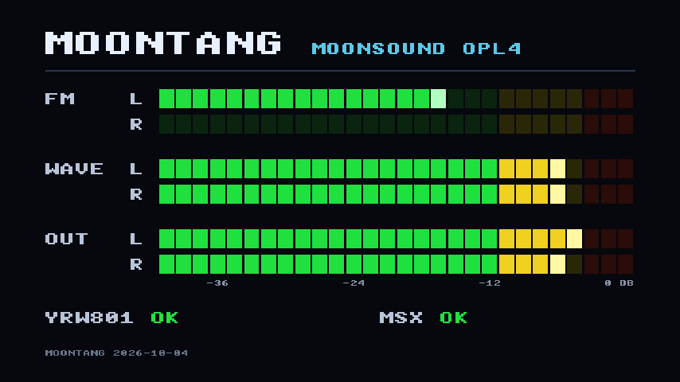

# MoonTANG on the WonderTANG 2.02b

The OPL4 has played on a WonderTANG 2.02b with an earlier build of the HDMI
bitstream (the one of the morning of 5 October, before the latest fixes). The
bitstreams in `bitstream/` — the MSX‑Audio one included — have not been run on
hardware yet. This is the bring‑up guide.

## What you need

- A WonderTANG **2.02b** with its Tang Nano 20K.
- **Jumper J3 soldered** to the Tang's speaker pads. On these boards the sound goes
  through the Tang's own I2S amplifier and J3 into the slot's `SOUNDIN` pin: the
  MoonSound is heard through the MSX's audio output, **in mono** (left + right
  mixed). Without J3 there is no sound.
- The Yamaha **YRW801** wave ROM as `yrw801.bin` (2 MB, not included).

## What to flash

| Step | File | Address | Gowin Programmer operation |
|---|---|---|---|
| 1 | **one** of the three bitstreams below | `0x000000` | External Flash mode |
| 2 | `yrw801.bin` | `0x200000` | exFlash C Bin Erase, Program thru GAO‑Bridge |

| Bitstream | What it does |
|---|---|
| `bitstream/moontang_wondertang202b_msxaudio_1.0.1beta.fs` | MoonSound **and MSX‑Audio**, without HDMI. Sound to the MSX only. |
| `bitstream/moontang_wondertang202b_hdmi_1.0.1beta.fs` | MoonSound with HDMI: sound to the MSX **and**, at the same time, stereo sound and a VU meter on the Tang's HDMI connector. |
| `bitstream/moontang_wondertang202b_hdmi_msxaudio_1.0.1beta.fs` | MoonSound, MSX‑Audio **and** HDMI together. This is the high-occupancy beta build. |

Which one:

- **MSX‑Audio, no HDMI** — for everyday use through the MSX's own speakers: the
  MoonSound plus an MSX‑Audio, both heard through J3.
- **OPL4 + HDMI** — if a real MSX‑Audio (Philips Music Module, Panasonic FS‑CA1,
  Toshiba HX‑MU900) is already plugged into another slot. The HDMI screen also
  shows that the wave ROM, MSX clock and audio path are alive.
- **MSX‑Audio + HDMI** — the all-in-one beta build. It offers both chips and HDMI,
  but uses 91 % of the FPGA CLS; load it in SRAM first.

For a first try you can load the `.fs` into **SRAM** instead (it is lost at power
off): if something is wrong the board is back to its previous firmware after a
power cycle. Do it with the MSX off (the Tang powered from USB), or reset the MSX
afterwards.

- **Check the wave ROM after every flash.** With some tools, erasing the flash for
  a new bitstream also wipes the area after it (mangOPL4 lost another image that
  way twice on this board). `0x200000` is also where tnCart keeps a megaROM and
  where the MSXnano keeps its BIOS pack: after using the Tang with another
  firmware, flash `yrw801.bin` again. The HDMI screen (`YRW801 NO VALIDA`) and
  the LED say so if the image is not the YRW801; `mt4yrw` (see
  [`tools/msx/`](../tools/msx/)) checks it from the MSX.
- With openFPGALoader: `openFPGALoader -b tangnano20k --external-flash -o 2097152 yrw801.bin`.

## The MSX‑Audio bitstream

`moontang_wondertang202b_msxaudio_*.fs` adds a Y8950 — the MSX‑Audio chip — next
to the MoonSound. Nothing else has to be flashed for it.

- **Ports `C0h–C1h`**, the first MSX‑Audio unit. `C2h–C3h` stay free.
- **FM**: 9 channels, rhythm mode included. **ADPCM**: 256 KB of sample RAM, the
  most the Y8950 addresses, kept in the Tang's SDRAM apart from the MoonSound's
  memory.
- **No MSX‑Audio BIOS.** The cartridge only answers I/O ports. Software that drives
  the chip directly should work — **VGMPlay**, **MoonBlaster 1.4** (FM and ADPCM
  samples), games that write to the ports — but none of it has been tried yet.
  Software that needs the MSX‑Audio BIOS ROM — **FAC SoundTracker**, for instance —
  does not find it.
- **`/INT`.** The Y8950 interrupt (timer 1, timer 2, end of sample, buffer ready,
  each with its mask in register 04h) shares `/INT` with the OPL4's. After a reset
  every source is masked. The MSX BIOS interrupt handler does not clear the
  Y8950's flags (with a real MSX‑Audio either): a program that unmasks a source
  has to clear it itself (register 04h = 80h). Buffer ready, unmasked while the
  ADPCM is idle, cannot be cleared at all (it is a level): `/INT` stays asserted
  until it is masked again.
- **Write timing**: after a data write to an FM register (20h and up), leave about
  23 µs (84 cycles of 3.58 MHz) before the next one, as the real chip requires.
  Software written for the MSX‑Audio already does.
- **Sound**: mono, into both channels of the mix, so it goes out through J3 with
  the MoonSound. No HDMI.
- Not there: recording (the ADC), the DAC data registers, and the keyboard and
  general‑purpose I/O ports of the chip.

`mt7aud` (see [`tools/msx/`](../tools/msx/)) checks it from the MSX.

## The HDMI output

Plug a TV or an HDMI monitor with speakers into the Tang's HDMI connector. It is
optional: with nothing connected the cartridge behaves exactly the same.

- Six bars: **FM** left/right, **WAVE** (the PCM wavetable) left/right, and **OUT**,
  the mix. 28 segments of 1.5 dB; the bright segment is the peak.
- `YRW801 OK` / `...` (still copying) / `NO VALIDA` (the copy finished, but the
  image in the flash is not the YRW801: a blank flash, a megaROM left there by
  another firmware, a truncated file) / `ERROR` (the copy did not finish: flash or
  SDRAM not answering). And `MSX OK` / `--`. The check is a sum of the 2 MB copied,
  compared with the sum of the real YRW801; `mt4yrw` checks what the MSX reads.
- `SAMPLE RAM`: 28 segments show the high-water mark of the OPL4's 2 MiB custom
  sample RAM.  A segment is about 3.6 %.  It is the highest byte address written
  since power-up, rather than an allocation count: the YMF278B has no file system
  or allocator.  Therefore a single write near the end correctly lights nearly
  the whole bar; the YRW801 ROM and the MSX-Audio ADPCM RAM are not included.
- The HDMI sound is **stereo**, 48 kHz; the sound that goes into the MSX is the
  same mix in mono.
- 720×480 at 60 Hz, flagged 16:9. A DVI‑only monitor will not take it.

## LED (pin 75)

| LED | Meaning |
|---|---|
| off | a PLL did not lock |
| fast blink | SDRAM initialising |
| slow blink | copying the YRW801 from flash to SDRAM (about 2 s) |
| double flash | the copy did not finish (flash or SDRAM not answering) |
| bursts of fast blinking every 0.6 s | copied, but the image in the flash is not the YRW801 |
| short flash every 0.6 s | ready, but no clock from the MSX (cartridge out, or MSX off) |
| steady on | ready and the MSX is running |

FM does not depend on the YRW801: **FM plays but the wavetable is silent** points at
the flash/SDRAM chain; **nothing at all** points at the bus or the power. The
MSX‑Audio does not depend on the YRW801 either, but its ADPCM samples live in the
SDRAM.

## Things to know before powering it

- **Power.** The WonderTANG feeds the Tang through a Schottky diode. On our board
  the Tang saw 4.59 V from a 5.0 V slot, which is marginal; if the Tang does not
  start reliably, check the 5 V rail first.
- **MSX off, USB plugged.** With the Tang powered from USB and the MSX off, the slot
  lines float. The cartridge does not touch the data bus, `/WAIT` or `/INT` until it
  sees the slot clock running and `/RESET` released.
- **`/WAIT` and `/INT` during configuration.** The FPGA takes about 3 s to load
  its configuration from flash. During that time the board's own pull‑up holds
  `/WAIT` asserted, so the MSX waits (a black screen for ~3 s is expected), and
  `/INT` is undefined. If the MSX does not boot with the cartridge in, look at
  those two lines with a scope at power‑up.
- **Speed.** At 3.58 MHz `/WAIT` reaches the Z80 with about 70 ns to spare. From
  5.37 MHz on it may arrive too late: reading the wave memory (not playing it)
  can fail in turbo modes. The other ports (FM, and the MSX‑Audio) do not use
  `/WAIT`; in simulation their reads are right with margin up to 7.16 MHz, and
  right but at the limit at 10.74 MHz.
- **Detection right after power‑up.** For the ~2 s the wave ROM is being copied the
  PCM engine is held in reset: a program that looks for the MoonSound in that
  window will not see the wavetable. Wait for the LED to stay on.
- **Level.** FM keeps the OPL4 `F8h` setting. The wavetable keeps `F9h` and has
  an additional fixed 8.87 dB trim (2.87 dB lower than the original MoonTANG
  6 dB setting) so PCM instruments do not dominate at the reset level.
  With the MSX‑Audio bitstream the Y8950 is added with the MSXimus balance,
  and a limiter compresses the peaks of the sum above 3/4 of full scale (2:1)
  instead of clipping them; below that nothing changes. `tools/msx/MTVOL.COM`
  controls the native OPL4 FM/Wave mixer only: `0` is the lowest numeric level,
  `18` is maximum and `M` mutes. It deliberately does not alter the Y8950
  MSX-Audio mix.

## Telemetry

The PCM engine sends a status line over the Tang's USB serial port (115200 8N1)
once it is running. `tools/dbg_reader.py` decodes it. It is silent until the YRW801
copy has finished.

## If the wave memory misbehaves

The embedded SDRAM runs at 108 MHz. Read data is captured half a cycle later than
in the original controller (which was tuned for 85.9 MHz), at the point the official
WonderTANG firmware and tnCart use at this frequency. The original capture point is
still available as a parameter (`SDRAM_RD_CAPTURE_CLK = 0` in the top of each
bitstream: `moontang_top.sv`, `moontang_wt_audio_top.sv`, `moontang_wt_hdmi_top.sv`)
in case a board prefers it.

## Experimental: HDMI and MSX‑Audio together

`fpga/files/20261005/moontang_wondertang202b_hdmi_msxaudio_EXPERIMENTAL_20261005.fs`
(built with `fpga/build_wt_hdmi_audio.tcl`; deliberately not in `bitstream/`) is the
HDMI bitstream with the Y8950 of the MSX‑Audio bitstream switched on: everything both
of them do, at the same time. The VU meter gets a seventh bar, **MSX‑AUDIO** (mono:
what the Y8950 adds to the mix), between WAVE and OUT. It is flashed like the others
(the `.fs` at `0x000000`, the YRW801 at `0x200000`).

It fills the chip: 68 % of the logic and 90 % of the CLS (the HDMI bitstream: 55 %
and 76 %). Gowin closes timing on every build tried: 0 setup and 0 hold violations
in 6 builds — 4 different placements, two of them routed twice, and two of the
placements with the design slightly perturbed — with at least 1.2 ns of setup
margin (hold: at least 0.074 ns, on BSRAM data inputs). This
one has 2.75 ns of setup margin on the 108 MHz clock. The board bench passes on it
(`run_board.sh hdmi_audio`, see [VERIFICATION.md](VERIFICATION.md)). It has **not
been tried on hardware**, and there is one risk timing analysis cannot see: the
interface with the Tang Nano 20K's embedded SDRAM (`O_sdram_*`, `IO_sdram_dq`) is
not constrained in the `.sdc` of any MoonTANG bitstream, so "timing met" says
nothing about it; how much margin it has depends on where the registers that drive
and capture it end up, and in a chip this full they move more from one build to
the next. If the wave memory or the ADPCM misbehave with this bitstream and not
with the others, that is the first suspect.
